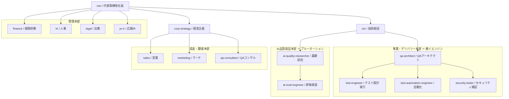

# 株式会社ベリエージェント（VeriAgent Inc.）— AIエージェント組織

> 一流の上場企業「**株式会社ベリサーブ**」（ソフトウェア第三者検証の最大手 / 東証・証券コード3724 / SCSK・CTC系）をモデルに、その組織を **Claude Code のサブエージェント群** として再現した「動く会社」です。
> 各部門が実際に協働し、**ブルーオーシャン＝「AIエージェント／LLM の第三者品質保証」** で稼ぐことを目的に設計しています。

本業（ソフトウェアテスト／第三者検証）の収益基盤の上に、**AIがAIを検証する**新市場を載せた構造です。

> モデルは実在のベリサーブですが、本ディレクトリは敬意を込めた**学習・実装用の架空企業**であり、同社の公式組織図ではありません。

---

## 構成
- `../.claude/agents/*.md` … **社員＝16の役職エージェント**（経営〜現場〜管理）。役割ごとに呼び出して働かせる。
- `../.claude/commands/*.md` … **部門横断の協働ワークフロー**（受注・AI検証・経営会議・新規事業）。
- `organization.md` … 組織図・各部門の役割・レポートライン。
- `operating-model.md` … 協働モデル（誰が誰に何を渡すか・RACI・会議体）。
- `blue-ocean-strategy.md` … ブルーオーシャン戦略（AIエージェント品質保証）。
- `value-flow.md` … 収益モデル（どう稼ぐか）。
- `../products/ai-agent-qa/` … ブルーオーシャンの**売り物**（評価方法論＋動くランナー＋納品テンプレ）。

---

## 使い方

### 1. 個別の社員（役職）に相談する
メイン会話で役割を指定すると、その専門エージェントに委任されます。
- 「`qa-architect` として、ECサイトのテスト計画を作って」
- 「`ai-quality-researcher` に、社内チャットボットの評価設計を頼みたい」
- 「`finance`、この案件（15人日）の見積採算を出して」

### 2. 部門横断ワークフローを回す（スラッシュコマンド）
| コマンド | 役割 | 主な連携部門 |
|---|---|---|
| `/win-deal <案件概要>` | 受注プロセス一気通貫 | 営業→QA設計→財務→法務→提案書 |
| `/ai-qa <対象AIの概要>` | **ブルーオーシャン**：AIの第三者検証→納品レポート | 研究→評価実装→安全性→レビュー |
| `/board-meeting <議題>` | 経営会議で意思決定 | 経営企画・技術・財務→CEO |
| `/new-service <テーマ>` | 新規事業を企画 | 経営企画→研究→技術→GTM→財務 |

### 3. 売り物を動かす（実際に稼ぐ）
```bash
python3 products/ai-agent-qa/eval_runner.py products/ai-agent-qa/eval_spec.example.json
```
AIの出力を評価仕様に沿って採点し、軸別スコア・合否・回帰を出力します（詳細は `../products/ai-agent-qa/README.md`）。

---

## 組織図



詳細は [`organization.md`](organization.md)。

## 設計メモ
- Claude Code のサブエージェントは**互いを直接起動できない**（無限再帰防止）。そのため部門間協働は「メインセッション（オーケストレーター）が順に各エージェントを呼び、成果物を引き継ぐ」設計。その台本が `../.claude/commands/` のワークフロー。
- 各エージェントは原則すべてのツールを継承（`tools` 未指定）し、実際に成果物を作れるようにしている。
- モデル割当：戦略・方法論・統括は `opus`、実装・実行は `sonnet`。
