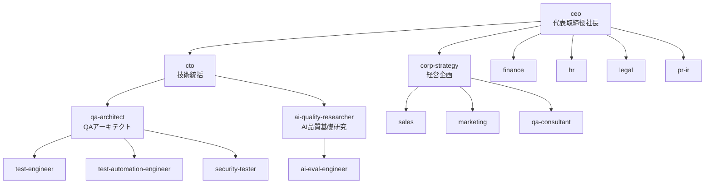

# 組織図と各部門の役割

株式会社ベリエージェント（モデル：株式会社ベリサーブ）の組織を、Claude Code サブエージェントとして再現したものです。実在のベリサーブの事業構造（第三者検証／テスト自動化／セキュリティ／QAコンサル・教育／研究開発／プロダクト＝QualityForward・GIHOZ相当）を踏まえ、ブルーオーシャン「AIエージェント品質保証」を加えています。

## レポートライン

## 各エージェント一覧

| エージェント | 役職 | レイヤ | 主担当 | モデル |
|---|---|---|---|---|
| `ceo` | 代表取締役社長 | 経営 | 全社意思決定・オーケストレーション | opus |
| `corp-strategy` | 経営企画室長 | 経営 | 中期計画・事業ポートフォリオ・戦略 | opus |
| `cto` | 技術統括(CTO) | 経営 | 検証方法論・技術標準・R&D方針 | opus |
| `qa-architect` | QAアーキテクト | デリバリー | テスト戦略・計画・見積根拠・品質ゲート | opus |
| `test-engineer` | テストエンジニア | デリバリー | テスト設計技法・ケース作成・実行 | sonnet |
| `test-automation-engineer` | テスト自動化エンジニア | デリバリー | 自動化・CI・回帰 | sonnet |
| `security-tester` | セキュリティ検証 | デリバリー | 脆弱性・安全性（防御的） | sonnet |
| `ai-quality-researcher` | AI品質研究員 | AI品質 | 評価方法論・指標・ルーブリック | opus |
| `ai-eval-engineer` | AI評価エンジニア | AI品質 | eval実装・実行・レポート | sonnet |
| `sales` | 営業 | 成長 | 発掘・提案・受注 | sonnet |
| `marketing` | マーケティング | 成長 | 市場分析・需要創造・リード | sonnet |
| `qa-consultant` | QAコンサルタント | 成長 | プロセス改善・内製化・教育 | opus |
| `finance` | 経理財務(CFO的) | 管理 | 見積採算・P&L・ROI | sonnet |
| `hr` | 人事 | 管理 | 採用・体制・スキル・育成 | sonnet |
| `legal` | 法務 | 管理 | 契約・知財・コンプラ | sonnet |
| `pr-ir` | 広報・IR | 管理 | 対外発信・IR・ブランド | sonnet |

## 4つの本部（機能ブロック）

### 1. 経営（CEO / 経営企画 / 技術統括）
会社の方向と資源配分を決める。`ceo` が最終意思決定、`corp-strategy` が戦略立案、`cto` が技術の背骨。

### 2. 事業・デリバリー本部 ＝ 稼ぐエンジン（既存事業）
ベリサーブの本業に相当。`qa-architect` を司令塔に、`test-engineer`／`test-automation-engineer`／`security-tester` が**実際の検証成果物**を生む。安定収益の源泉。

### 3. AI品質保証本部 ＝ ブルーオーシャン（新規事業）
`ai-quality-researcher`（方法論）＋`ai-eval-engineer`（実装・実行）。「AIがAIを検証する」新市場。成長エンジン。詳細は [blue-ocean-strategy.md](blue-ocean-strategy.md)。

### 4. 成長・顧客本部 / 管理本部
`sales`/`marketing`/`qa-consultant` が需要と顧客を、`finance`/`hr`/`legal`/`pr-ir` が会社の土台（採算・体制・契約・対外）を支える。

## モデル選定の考え方
- 戦略・方法論・統括など**深い思考が要る役職**は `opus`。
- 実装・実行・定型処理が中心の役職は `sonnet`。
- いずれも `tools` を絞らず全ツール継承とし、実際に成果物を作れるようにしている。
